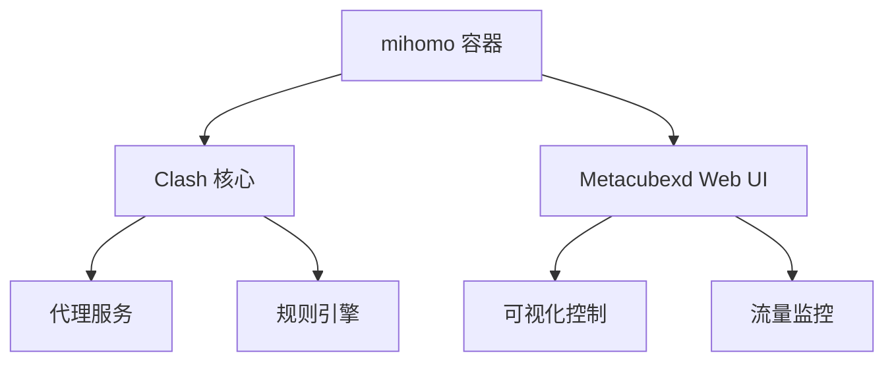
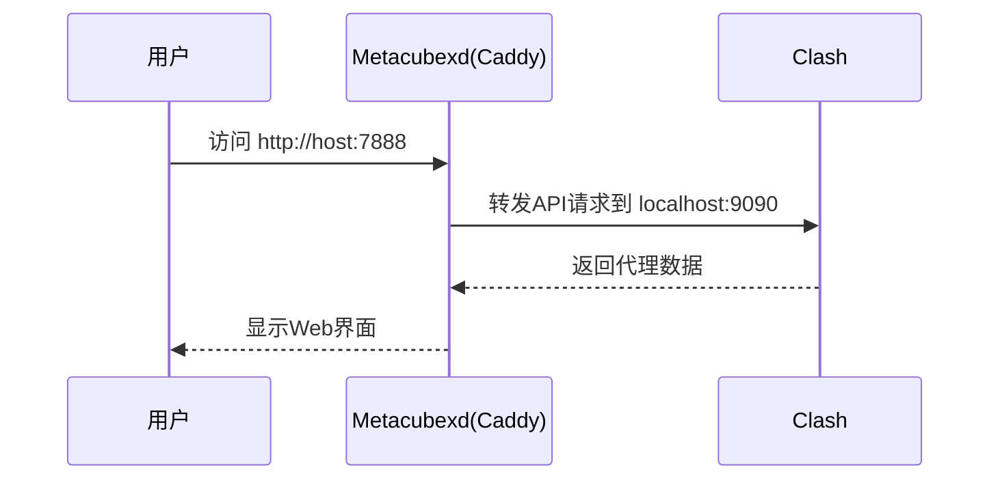

### mihomo Docker 镜像完整使用指南

#### 📦 镜像组成




------

#### 🌐 Metacubexd Web UI 详解

##### 核心配置

```yaml
ports:
  - "8080:8080"  # Metacubexd Web UI 端口映射
volumes:
  - ./metacubexd-config:/config/caddy  # 配置持久化
```

##### 关键特性

1. **端口关系**：

   - 容器内部端口：`8080`（Metacubexd 默认端口）
   - 宿主机映射端口：`8080`（可自定义）

2. **访问方式**：

   ```http
   http://<宿主机IP>:7888
   ```

   示例：`http://localhost:7888` 或 `http://192.168.1.100:7888`

3. **身份验证**：

   - 需设置 `CLASH_SECRET` 环境变量作为登录密码
   - 未设置时可直接访问（**不推荐**）

4. **功能矩阵**：

   | 功能模块     | 说明                    |
   | :----------- | :---------------------- |
   | 代理节点选择 | 实时切换代理节点        |
   | 流量统计     | 实时/历史流量图表       |
   | 规则管理     | 查看/调试流量匹配规则   |
   | 连接监控     | 活动连接列表及状态      |
   | 配置编辑器   | 在线编辑 Clash 配置文件 |
   | 订阅管理     | 手动更新订阅            |

------

#### ⚙️ 完整配置文件

```yaml
version: '3.8'

services:
  mihomo:
    container_name: mihomo
    image: daitcl/mihomo:latest
    restart: always
    environment:
      # 时区设置
      - TZ=Asia/Shanghai
      
      # 日志配置（silent/info/debug/warning）
      - LOG_LEVEL=silent
      
      # 安全设置（Web UI访问密码）
      - CLASH_SECRET=your_password
      
      # 订阅配置
      - SUBSCRIBE_URL=https://your.subscribe/link
      - SUBSCRIBE_NAME=my_config
      
    ports:
      # 代理服务端口
      - "7890:7890"  # HTTP代理
      - "7891:7891"  # SOCKS5代理
      - "7892:7892"  # 混合代理
      - "7893:7893"  # TPROXY透明代理
      - "7894:7894"  # REDIR透明代理
      
      # 管理端口
      - "9090:9090"  # Clash RESTful API
      - "7888:8080"  # Metacubexd Web UI（关键配置）
    
    # 健康检查
    healthcheck:
      test: ["CMD", "curl", "-f", "http://localhost:9090"]
      interval: 30s
      timeout: 10s
      retries: 3
    
    volumes:
      # 核心配置持久化
      - ./clash-config:/root/.config/mihomo
      
      # Metacubexd配置持久化
      - ./metacubexd-config:/config/caddy
      
      # 时区同步（可选）
      # - /etc/timezone:/etc/timezone:ro
      # - /etc/localtime:/etc/localtime:ro
    
    # TUN模式（透明代理）
    # cap_add:
    #   - NET_ADMIN
    # devices:
    #   - /dev/net/tun:/dev/net/tun
    
    networks:
      - clash-net

networks:
  clash-net:
    driver: bridge
```

------

#### 🔧 Metacubexd 高级配置

##### 自定义配置路径

1. **查看默认配置**：

   ```bash
   ls ./metacubexd-config
   # 输出示例：
   # Caddyfile  sites-enabled/  ssl/
   ```

2. **修改Caddy配置**（反向代理/HTTPS）：
   编辑 `./metacubexd-config/Caddyfile`：

   ```nginx
   {
       # 启用HTTPS（需提供证书）
       auto_https disable_redirects
   }
   
   :8080 {
       # 基本认证（与CLASH_SECRET联动）
       basicauth /* {
           clash $2a$14$YOUR_PASSWORD_HASH
       }
       
       # 反向代理设置
       reverse_proxy http://localhost:9090
       
       # 自定义路由
       handle_path /dashboard/* {
           root * /usr/share/caddy
           file_server
       }
   }
   ```

##### 配置更新流程




------

#### 🚀 部署操作指南

1. **初始化目录**：

   ```bash
   mkdir -p {clash-config,metacubexd-config}
   ```

2. **启动服务**：

   ```bash
   docker-compose up -d
   ```

3. **访问控制面板**：

   - 浏览器打开：`http://your-server-ip:7888`
   - 输入 `CLASH_SECRET` 设置的口令

4. **验证服务状态**：

   ```bash
   docker-compose ps
   # 应显示 mihomo 状态为 Up (healthy)
   ```

------

#### ⚠️ 故障排除

##### Metacubexd 访问问题

| 现象            | 解决方案                            |
| :-------------- | :---------------------------------- |
| 无法打开页面    | 检查 `8080` 端口防火墙规则          |
| 持续加载无数据  | 验证 `CLASH_SECRET` 与API连通性     |
| 403 Forbidden   | 确认 `./metacubexd-config` 目录权限 |
| 样式/JS加载失败 | 清除浏览器缓存或检查Caddy配置       |

##### 日志检查命令

```bash
docker-compose logs -f mihomo
# 关注以下关键词：
# - "Starting MetaCubeX daemon"
# - "Caddy serving initial configuration"
```

------

#### 🔄 维护操作

1. **备份配置**：

   ```bash
   tar czvf clash-backup-$(date +%s).tar.gz ./clash-config ./metacubexd-config
   ```

2. **版本升级**：

   ```bash
   docker-compose pull
   docker-compose up -d --force-recreate
   ```

> 项目源码：[mihomo](https://github.com/MetaCubeX/mihomo) | [Metacubexd](https://github.com/MetaCubeX/metacubexd)