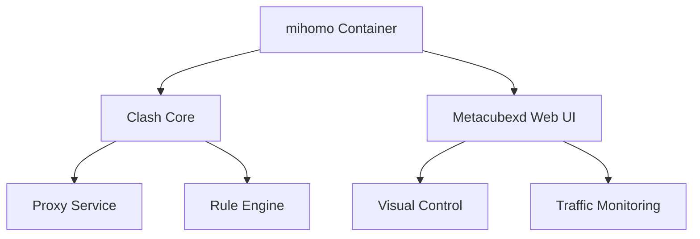
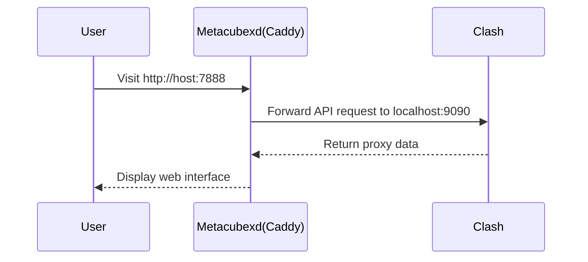
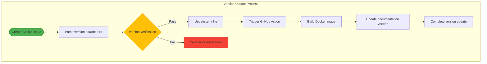

# mihomo Docker Image Complete Usage Guide


<div align="right">
  <a href="README_EN.md">English</a>&nbsp;|&nbsp;<a href="README.md">中文</a>
</div>

## Table of Contents
1. [Installation and Deployment](#installation-and-deployment)
2. [Configuration Details](#configuration-details)
3. [Usage Guide](#usage-guide)
4. [Maintenance and Management](#maintenance-and-management)
5. [Troubleshooting](#troubleshooting)

## Installation and Deployment

#### 📦 Image Composition




------

#### 🌐 Metacubexd Web UI Detailed Explanation

##### Core Configuration

```yaml
# Metacubexd management port
- "7888:8080"  # Web UI port mapping

# Configuration persistence
- ./metacubexd-config:/config/caddy
```

##### Key Features

1. **Port Relationships**:
   
   - Container internal port: `8080` (Metacubexd default port)
   - Host mapping port: `8080` (customizable)

2. **Access Method**:
   
   ```http
   http://<host-ip>:7888
   ```
   Example: `http://localhost:7888` or `http://192.168.1.100:7888`

3. **Authentication**:
   
   - Requires setting `CLASH_SECRET` environment variable as login password
   - Direct access without setting (**not recommended**)

4. **Feature Matrix**:
   
   | Feature Module | Description |
   | :----------- | :---------------------- |
   | Proxy Node Selection | Real-time proxy node switching |
   | Traffic Statistics | Real-time/historical traffic charts |
   | Rule Management | View/debug traffic matching rules |
   | Connection Monitoring | Active connection list and status |
   | Configuration Editor | Online editing of Clash configuration files |
   | Subscription Management | Manual update of node subscriptions |

------

#### ⚙️ Complete Configuration File

```yaml
version: '3.8'

services:
  mihomo:
    container_name: mihomo
    image: daitcl/mihomo:latest
    restart: always
    environment:
      # Time zone setting
      - TZ=Asia/Shanghai
      
      # Log configuration (silent/info/debug/warning)
      - LOG_LEVEL=silent
      
      # Security settings (Web UI access password)
      - CLASH_SECRET=your_password
      
      # Subscription configuration
      - SUBSCRIBE_URL=https://your.subscribe/link
      - SUBSCRIBE_NAME=my_config
      
    ports:
      # Proxy service ports
      - "7890:7890"  # HTTP proxy
      - "7891:7891"  # SOCKS5 proxy
      - "7892:7892"  # Mixed proxy
      - "7893:7893"  # TPROXY transparent proxy
      - "7894:7894"  # REDIR transparent proxy
      
      # Management ports
      - "9090:9090"  # Clash RESTful API
      - "7888:8080"  # Metacubexd Web UI (key configuration)
    
    # Health check
    healthcheck:
      test: ["CMD", "curl", "-f", "http://localhost:9090"]
      interval: 30s
      timeout: 10s
      retries: 3
    
    volumes:
      # Core configuration persistence
      - ./clash-config:/root/.config/mihomo
      
      # Metacubexd configuration persistence
      - ./metacubexd-config:/config/caddy
      
      # Time zone synchronization (optional)
      # - /etc/timezone:/etc/timezone:ro
      # - /etc/localtime:/etc/localtime:ro
    
    # TUN mode (transparent proxy)
    # cap_add:
    #   - NET_ADMIN
    # devices:
    #   - /dev/net/tun:/dev/net/tun
    
    networks:
      - clash-net

networks:
  clash-net:
    driver: bridge
```

------

### 🔧 Advanced Configuration

##### Custom Configuration Path

1. **View default configuration**:
   
   ```bash
   ls ./metacubexd-config
   # Output example:
   # Caddyfile  sites-enabled/  ssl/
   ```

2. **Modify Caddy configuration** (reverse proxy/HTTPS):
   Edit `./metacubexd-config/Caddyfile`:

   ```nginx
   {
       # Enable HTTPS (certificate required)
       auto_https disable_redirects
   }
   
   :8080 {
       # Basic authentication (linked with CLASH_SECRET)
       basicauth /* {
           clash $2a$14$YOUR_PASSWORD_HASH
       }
       
       # Reverse proxy settings
       reverse_proxy http://localhost:9090
       
       # Custom routing
       handle_path /dashboard/* {
           root * /usr/share/caddy
           file_server
       }
   }
   ```

##### Configuration Update Flow




------

#### 🚀 Deployment Operation Guide

1. **Initialize directories**:
   
   ```bash
   mkdir -p {clash-config,metacubexd-config}
   ```

2. **Start service**:
   
   ```bash
   docker-compose up -d
   ```

3. **Access control panel**:
   
   - Open in browser: `http://your-server-ip:7888`
   - Enter password set by `CLASH_SECRET`

4. **Verify service status**:
   
   ```bash
   docker-compose ps
   # Should show mihomo status as Up (healthy)
   ```

------

#### ⚠️ Troubleshooting

##### Metacubexd Access Issues

| Symptom | Solution |
| :-------------- | :---------------------------------- |
| Unable to open page | Check `8080` port firewall rules |
| Continuous loading without data | Verify `CLASH_SECRET` and API connectivity |
| 403 Forbidden | Confirm `./metacubexd-config` directory permissions |
| Styles/JS failed to load | Clear browser cache or check Caddy configuration |

##### Log Checking Command

```bash
docker-compose logs -f mihomo
# Pay attention to these keywords:
# - "Starting MetaCubeX daemon"
# - "Caddy serving initial configuration"
```

------

## Maintenance and Management

### 🛠️ Version Update

<details>
<summary>Click to expand version update example</summary>

```shell


**Trigger requirements**:
- Issue title format: `Update MI_VERSION=... MetaCubeX_VERSION=...`
- Version format complies with semantic versioning (vX.Y.Z)
- Includes version verification log snippet

**Example code**:
```shell
# Standard commit format:
MI_VERSION=v1.2.3 MetaCubeX_VERSION=v4.5.6

# Quick commit example:
Update MI_VERSION=v1.2.0 MetaCubeX_VERSION=v1.19.0
```

</details>

**Verification log**:

```
[Version check] Passed semantic-version check
[Configuration update] Successfully updated .env file
[Image build] Completed multi-arch image build
```


#### System Monitoring
| Monitoring Item | Frequency | Notification Method |
|----------------|----------|----------------|----------------|--------------|
| Container health status | Every minute | Enterprise WeChat |
| Component version updates | Daily | GitHub |
| Core port status | Real-time | Prometheus |
| Configuration changes | Hourly | System logs |

**Version update example**:
```
Update version MI_VERSION=v1.20.0 MetaCubeX_VERSION=v1.190.0
```

After update, execute:
```bash
docker-compose up -d --force-recreate
```

> Project source code: [mihomo](https://github.com/MetaCubeX/mihomo) | [Metacubexd](https://github.com/MetaCubeX/metacubexd)